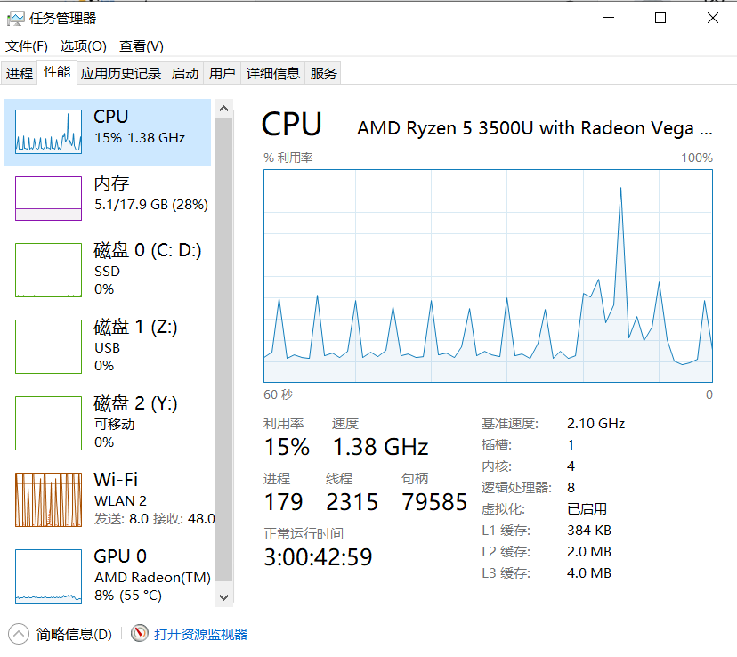

# 线程和线程池

## 基本概念

<h6 style='visibility:hidden'>20230525211632</h6>

### [进程](file_id#20230525211632)

1. 进程（Process）是计算机中的程序关于某[数据集](https://baike.baidu.com/item/数据集/4745883?fromModule=lemma_inlink)合上的一次运行活动，是系统进行[资源分配](https://baike.baidu.com/item/资源分配/2944359?fromModule=lemma_inlink)的[基本单位](https://baike.baidu.com/item/基本单位/10189558?fromModule=lemma_inlink)，是操作系统结构的基础。在早期**面向进程**设计的计算机结构中，进程是程序的基本执行实体；在当代面向线程设计的计算机结构中，**进程是线程的容器**。程序是指令、数据及其组织形式的描述，进程是程序的实体。
2. 进程就是一个正在运行的程序，每个程序都有启动，运行，结束的生命周期。
3. 如图所示正在运行179个进程。

<h6 style='visibility:hidden'>20230525212954</h6>

### [线程](file_id#20230525212954)

1. 线程是进程的一个实例，一个进程可以同时运行多个线程。比如百度网盘可以同时下载10个文件等等。
2. 如图所示正在运行2315个线程。

> 什么是四核八线程？
>
> 如图所示，核心4（物理CPU），逻辑处理器8，Intel利用超线程技术使核心数翻倍，以达到更高的性能。

<h6 style='visibility:hidden'>20230525213315</h6>

### [并发](file_id#20230525213315)

单核CPU在同一时刻，交替运行多个任务，造成一种同时运行的错觉，这就是并发。

<h6 style='visibility:hidden'>20230525213544</h6>

### [并行](file_id#20230525213544)

多核CPU在同一时刻，同时运行多个任务，这就是并行。

并发和并行可以同时存在，在并行的基础上发生并发现象。

<h6 style='visibility:hidden'>20230526164148</h6>

### [同步机制](file_id#20230526164148)

即当有一个线程在对内存进行操作时，其他线程都不可以对这个内存地址进行操作，直到该线程完成操作， 其他线程才能对该内存地址进行操作，而其他线程又处于等待状态，实现线程同步的方法有很多，临界区对象就是其中一种。

<h6 style='visibility:hidden'>20230526165939</h6>

### [互斥锁](file_id#20230526165939)

1. 在编程中，引入了对象互斥锁的概念，来保证共享数据操作的完整性。每个对象都对应于一个可称为互斥锁的标记，这个标记用来保证在**任一时刻**，只能有**一个线程**访问该对象。
2. 对于synchronized方法，非静态方法的锁默认是当前对象，静态方法的锁默认是当前类本身。

<h6 style='visibility:hidden'>20230526181138</h6>

### [锁释放](file_id#20230526181138)

1. 同步方法和同步代码块正常结束后释放锁。
2. 线程发生异常被迫中断后释放锁。
3. 手动调用锁对象wait()方法，释放锁并等待，然后在一段时间后（notify()方法被调用）重新尝试获取锁。
4. sleep()方法不会释放锁，会一直阻塞。

<h6 style='visibility:hidden'>20230528003449</h6>

### [锁池](file_id#20230528003449)

1. 所有要竞争同步锁的线程都会进入对象锁池当中（BLOCKED），当持有锁的线程执行任务完成后会释放锁（TERMINATED），锁池中线程就会开始竞争锁，成功者会占有锁并进入就绪队列（READY），然后等待CPU调度服务分配资源（RUNNING）。

<h6 style='visibility:hidden'>20230528003501</h6>

### [等待池](file_id#20230528003501)

1. 当调用一个对象的wait()方法时，当前线程会进入此对象等待池中，然后释放锁资源（WEITING）。如果此时有其他线程调用这个对象的notify()方法，就会从等待池中随机挑选一个线程放入锁池，重新参与锁竞争（BLOCKED），如果wait线程竞争成功，就会从wait()方法之后继续执行。如果调用notifyAll()方法就会将所有等待池中的线程放入锁池中，其他流程和notify()方法一致。

<h6 style='visibility:hidden'>20230528151627</h6>

### [时间片](file_id#20230528151627)

1. cpu是基于时间片调度的. 理论上不管一个线程处理时间有多长, 它能运行的时间也就是一个时间片的时间, 处理完后就得释放cpu. 然而它释放了CPU后, 还是会立马又去抢占cpu,而且抢到的概率是一样的. 所以从应用层面看, 有时还是可以看到这个线程是占用100%的

最后,从经验来看, 一个JVM系统的CPU偏高一般就是以下几个原因:

1. 代码中存在死循环
2. JVM频繁GC
3. 加密和解密的逻辑
4. 正则表达式的处理
5. 频繁地线程上下文切换

## 应用

1. [查看电脑配置](jetbrains://idea/navigate/reference?project=java-thread.java&fqn=com.ariel.thread.thread.CpuCores)
2. [创建线程的几种方式](jetbrains://idea/navigate/reference?project=java-thread.java&fqn=com.ariel.thread.thread.CreateThread)
3. [中断线程](jetbrains://idea/navigate/reference?project=java-thread.java&fqn=com.ariel.thread.thread.Interupt)
4. [线程礼让和插队](jetbrains://idea/navigate/reference?project=java-thread.java&fqn=com.ariel.thread.thread.Daemon)
5. [守护线程](jetbrains://idea/navigate/reference?project=java-thread.java&fqn=com.ariel.thread.thread.Daemon)
6. [线程的生命周期](jetbrains://idea/navigate/reference?project=java-thread.java&fqn=com.ariel.thread.thread._20230526152457)
7. [synchronized非静态锁](jetbrains://idea/navigate/reference?project=java-thread.java&fqn=com.ariel.thread.thread._20230526171553)
8. [synchronized静态锁](jetbrains://idea/navigate/reference?project=java-thread.java&fqn=com.ariel.thread.thread._20230526173829)
9. [死锁](jetbrains://idea/navigate/reference?project=java-thread.java&fqn=com.ariel.thread.thread._20230526175429)
10. [线程通知](jetbrains://idea/navigate/reference?project=java-thread.java&fqn=com.ariel.thread.thread._20230526182156)
11. [线程的阻塞和唤醒park()和unpark()](jetbrains://idea/navigate/reference?project=java-thread.java&fqn=com.ariel.thread.thread._20230527154225)
12. [锁的可重入性](jetbrains://idea/navigate/reference?project=java-thread.java&fqn=com.ariel.thread.thread._20230527211528)
13. 