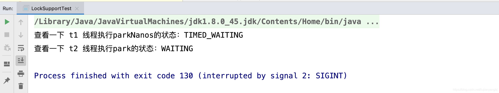
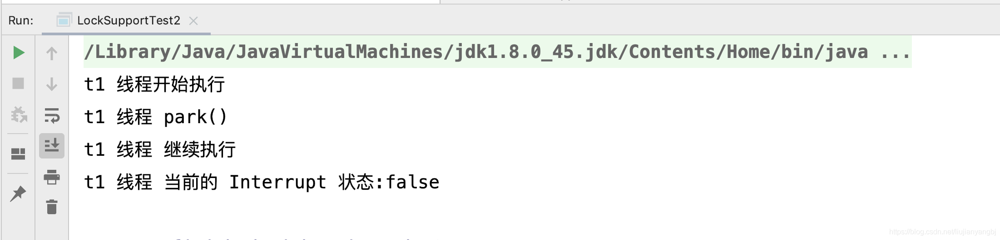
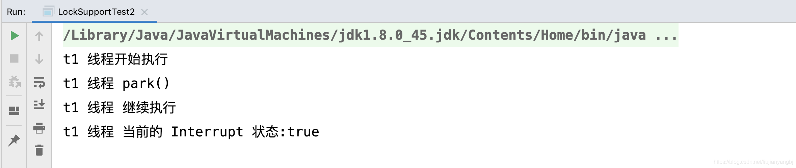
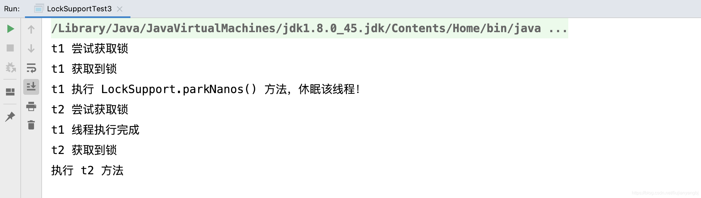
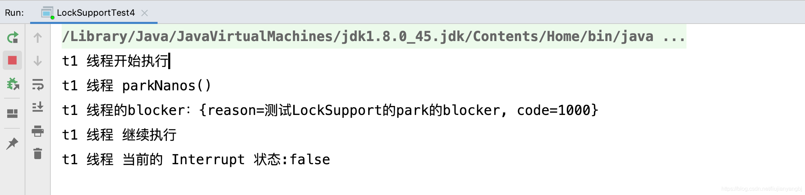

### 文章目录

-   [前言](https://blog.csdn.net/liujianyangbj/article/details/117919108#_6)
-   [一、看看JDK的代码注释](https://blog.csdn.net/liujianyangbj/article/details/117919108#JDK_13)
-   [二、案例](https://blog.csdn.net/liujianyangbj/article/details/117919108#_65)
-   -   [1\. 查看线程状态](https://blog.csdn.net/liujianyangbj/article/details/117919108#1__66)
    -   [2.线程被打断，不抛异常](https://blog.csdn.net/liujianyangbj/article/details/117919108#2_100)
    -   [2.是否会释放锁](https://blog.csdn.net/liujianyangbj/article/details/117919108#2_170)
    -   [3.传递自定义数据](https://blog.csdn.net/liujianyangbj/article/details/117919108#3_232)
-   [总结](https://blog.csdn.net/liujianyangbj/article/details/117919108#_274)

___

## 前言

Java的线程休眠我们从Thread.sleep到Object.wait(),都进行了逐一讲解，现在我们研究最后一种方式LockSupport.park()。

___

## 一、看看JDK的代码注释

```
/**
     * Disables the current thread for thread scheduling purposes unless the
     * permit is available.
     翻译：除非许可证可用，否则禁用当前出于线程调度目的线程。
     * <p>If the permit is available then it is consumed and the call
     * returns immediately; otherwise the current thread becomes disabled
     * for thread scheduling purposes and lies dormant until one of three
     * things happens:
     翻译：如果许可是可用的，那么这个许可会被消费掉，并且方法立刻返回。
     否则的话，当前的线程会被变成不可以用，并处于休眠状态，直至下面三种情况发生：
     * <ul>
     *
     * <li>Some other thread invokes {@link #unpark unpark} with the
     * current thread as the target; or
     翻译：其他线程调用了unpark（Thread t） 方法，参数t就是被休眠park的线程
     
     * <li>Some other thread {@linkplain Thread#interrupt interrupts}
     * the current thread; or
     *
     翻译：其他线程interrupts了此线程
     
     * <li>The call spuriously (that is, for no reason) returns.
     * </ul>
     *
     翻译：调用方法莫名其妙的返回了（没有什么原因）
     
     * <p>This method does <em>not</em> report which of these caused the
     * method to return. Callers should re-check the conditions which caused
     * the thread to park in the first place. Callers may also determine,
     * for example, the interrupt status of the thread upon return.
     * 
     * 翻译：该方法不会报道是由于哪一种情况导致的返回。
     * 调用者应该自行检查原因，调用者也可能根据返回的线程状态，进行推断。
     * 
     */
    public static void park() {
        UNSAFE.park(false, 0L);
    }
```

从上面的注释我们可以看出来和之前的Thread.sleep、Object.wait()不同的是，该方法不会直接进入休眠，而是会先根据一个permit来进行判断，如果有了permit，那么方法直接返回，如果没有得到permit才会进入休眠状态。  
那么进入休眠状态后，有三种情况会被打破  
1、其他线程调用了unpark（）方法，将该线程unpark了。  
2、其他线程interrupts了该线程  
3、其他莫名其妙的原因导致的  
最后，就是方法不会告知调用方具体是哪一种原因导致了解除睡眠状态，调用者应该重新检查线程，在第一次被park的条件。调用者也可以根据返回，来判断线程的中断状态。

另外，我们也可以看出来，此方法不会抛出受检查异常，这一点和Thread.sleep、Object.wait()不同。

## 二、案例

## 1\. 查看线程状态

代码如下：

```
package com.kinyang.lockSupport;

import java.util.concurrent.locks.LockSupport;

/**
 * @author KinYang.Liu
 * @date 2021/6/15 9:46 上午
 */
public class LockSupportTest {
    public static void main(String[] args) throws InterruptedException {
        Thread t1 = new Thread(()->{
            LockSupport.parkNanos(3000*4000*1000L);
        });
        Thread t2 = new Thread(()->{
            LockSupport.park();
        });
        t1.start();
        t2.start();
        Thread.sleep(1000L);
        System.out.println("查看一下 t1 线程执行parkNanos的状态："+t1.getState());
        System.out.println("查看一下 t2 线程执行park的状态："+t2.getState());
    }
}
```

运行结果  
  
从结果我们可以看出来：LockSupport.park()方法会进入WAITING状态，而LockSupport.parkNanos(long nanos) 会进入TIMED\_WAITING状态，这一点和Object.wait是一致的。  
可以指定一个休眠时间，不指定就是永久休眠，不会自动唤醒。

## 2.线程被打断，不抛异常

代码如下：

```
package com.kinyang.lockSupport;

import java.util.concurrent.locks.LockSupport;

/**
 * @author KinYang.Liu
 * @date 2021/6/15 9:46 上午
 */
public class LockSupportTest2 {
    public static void main(String[] args) throws InterruptedException {
        Thread t1 = new Thread(()->{
            System.out.println("t1 线程开始执行");
            System.out.println("t1 线程 park()  ");
            LockSupport.park();
            System.out.println("t1 线程 继续执行");
            System.out.println("t1 线程 当前的 Interrupt 状态:"+Thread.currentThread().isInterrupted());
        });

        t1.start();
        Thread.sleep(1000L);
        //  unpark t1线程
        LockSupport.unpark(t1);
    }
}
```

执行结果  
  
当通过LockSupport.unpark()唤醒线程的时候，线程的Interrupt 状态是fasle

```
package com.kinyang.lockSupport;

import java.util.concurrent.locks.LockSupport;

/**
 * @author KinYang.Liu
 * @date 2021/6/15 9:46 上午
 */
public class LockSupportTest2 {
    public static void main(String[] args) throws InterruptedException {
        Thread t1 = new Thread(()->{
            System.out.println("t1 线程开始执行");
            System.out.println("t1 线程 park()  ");
            LockSupport.park();
            System.out.println("t1 线程 继续执行");
            System.out.println("t1 线程 当前的 Interrupt 状态:"+Thread.currentThread().isInterrupted());
        });

        t1.start();
        Thread.sleep(1000L);
        /// 将t1 线程打断
          t1.interrupt();
    }
}
```

运行结果  
  
当我们通过 interrupt打断线程的时候，线程的Interrupt 状态是true。

通过上面两个例子，我们可以看到LockSupport.park();不会抛出受检查异常，当出现被打断的情况下，也不会抛出异常，但是会将Interrupt的状态修改，也就是当我们的线程被唤醒后，我们可以通过Interrupt的状态来判断，我们的线程是不是被interrupt的还是被unpark或者到达指定休眠时间。  
这一点和Thread.sleep和Object.wait()不同，他们两个当线程被打断的时候，会抛出异常，在catch到异常的时候，interrupt的状态其实是没有的，也就是你在catch代码块中得到的interrupt状态永远是false。

## 2.是否会释放锁

代码如下：

```
package com.kinyang.lockSupport;

import java.util.Scanner;
import java.util.concurrent.locks.LockSupport;

/**
 * @author KinYang.Liu
 * @date 2021/6/15 9:46 上午
 */
public class LockSupportTest3 {
    private static Object monitor = new Object();
    public static void main(String[] args) throws InterruptedException {
         创建一个 t1 线程
        Thread t1 = new Thread(() -> {
            System.out.println("t1 尝试获取锁");
            synchronized (monitor){
                System.out.println("t1 获取到锁");
                System.out.println("t1 执行 LockSupport.parkNanos() 方法，休眠该线程！");
                /// 我们执行 parkNanos 操作，让线程进入休眠，看看其他线程是否能抢到 monitor 锁，
                ///  如果其他线程可以获取到 monitor 锁后，那么说明sleep会释放monitor锁
                ///  否则，说明parkNanos不会释放monitor锁
                LockSupport.parkNanos(1000*1000*1000*5L);
                System.out.println("t1 线程执行完成");
            }
        },"t1-thread");
         启动t1线程
        t1.start();
        /// 这里让主线程休眠1s后，确保t1线程已经执行,并获取到锁
        Thread.sleep(1000L);
        Thread t2 = new Thread(() -> {
            System.out.println("t2 尝试获取锁");
            synchronized (monitor){
                System.out.println("t2 获取到锁");
                System.out.println("执行 t2 方法");
            }
        },"t2-thread");
        t2.start();
        Scanner scanner = new Scanner(System.in);
        while (scanner.hasNextLine()) {
            if (scanner.nextLine().equalsIgnoreCase("bye")){
                System.out.println("再见");
                break;
            }else {
                System.out.println("指令错误");
            }

        }
    }
}

```

运行结果  


从执行结果我们就能看出来是，LockSupport.parkNanos()是不会释放锁的。  
其实也很容易理解，LockSupport.park跟synchronized就没有关系，休眠线程的原理和Object.wait不同，LockSupport.park休眠线程不需要依赖monitor锁，所以也就不会涉及到释放与不释放锁，这一点和Thread.sleep()是一致的。

## 3.传递自定义数据

代码如下：

```
package com.kinyang.lockSupport;

import java.util.HashMap;
import java.util.concurrent.locks.LockSupport;

/**
 * @author KinYang.Liu
 * @date 2021/6/15 9:46 上午
 */
public class LockSupportTest4 {
    public static void main(String[] args) throws InterruptedException {
        Thread t1 = new Thread(()->{
            System.out.println("t1 线程开始执行");
            System.out.println("t1 线程 parkNanos()  ");
            HashMap blocker = new HashMap();
            blocker.put("reason","测试LockSupport的park的blocker");
            blocker.put("code","1000");
            LockSupport.parkNanos(blocker,2000*1000*2000L);
            System.out.println("t1 线程 继续执行");
            System.out.println("t1 线程 当前的 Interrupt 状态:"+Thread.currentThread().isInterrupted());
        });
        t1.start();
        Thread.sleep(1000L);
        Object blocker = LockSupport.getBlocker(t1);
        System.out.println("t1 线程的blocker："+blocker);
        Thread.sleep(1000*100L);
    }
}

```

执行结果  
  
LockSupport.park(Object blocker); 方法可以在park线程的时候，传一个Object参数。调用者在其他线程可以通过LockSupport.getBlocker(t1)参数。

___

## 总结

LockSupport.park()休眠线程，LockSupport.unpark()唤醒线程，两个方法配合使用。也可以通过LockSupport.parkNanos()指定休眠时间后，自动唤醒。  
LockSupport.park()不会释放monitor锁。  
线程被打断，LockSupport.park()不会抛出异常，也不会吞噬掉interrupt的状态，调用者可以获取interrupt状态，自行进行判断，线程是由于什么原因被唤醒了。  
LockSupport.park()会是线程进入WAITING状态，而LockSupport.parkNanos(long nanos) 会进入TIMED\_WAITING状态。  
LockSupport.park(Object blocker)和LockSupport.getBlocker(t1)配合使用，可以进行自定义数据传输。